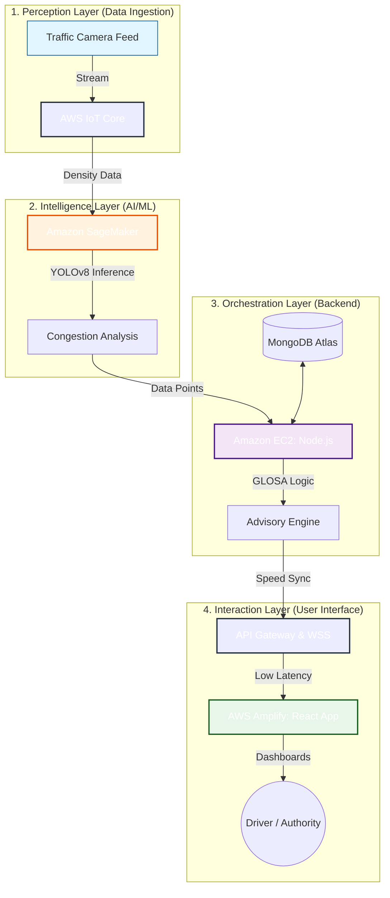

# 🚦 GLOSA-BHARAT 2.0: Intelligent Urban Mobility Ecosystem

[](https://hack2skill.com/)
[](https://opensource.org/licenses/MIT)
[](#-tech-stack)

**GLOSA-BHARAT 2.0** is the advanced evolution of the Green Light Optimal Speed Advisory ecosystem, specifically optimized for the **Hack2Skill AI for Bharat by AWS Hackathon**. This version leverages AWS-native services to eliminate urban traffic friction using indigenous AI.

---

## 🌟 Key Features

- **🚀 Real-time Speed Advisory**: Calculates and displays the optimal speed to catch the next green light.
- **🧠 Indigenous AI Core**: Custom-trained models (YOLOv8) optimized for heterogeneous Indian traffic (Bikes, Autos, Vans).
- **📊 Digital Twin Dashboard**: A futuristic Leaflet-based GIS dashboard for traffic authorities to monitor congestion and signal health.
- **⚡ Low-Latency Orchestration**: High-speed Node.js middleware for sub-second data routing.
- **🌱 Fuel & Emission Reduction**: Potential 15-20% reduction in fuel consumption and PM2.5 emissions.
- **🛰️ Hardware-Agnostic**: Works with existing government CCTV infrastructure—no expensive LIDAR needed.

---

## 🏗️ System Architecture

GLOSA-BHARAT 2.0 follows a **4-Stage Enterprise Architecture** designed for high-throughput, low-latency traffic orchestration, fully integrated with **AWS Cloud Native** services.



### Modular Components
1.  **Perception Layer**: Leverages computer vision to translate raw camera feeds into actionable traffic density metrics via **AWS IoT Core**.
2.  **Intelligence Layer**: Custom-trained **YOLOv8** models hosted on **Amazon SageMaker** identify vehicle types and queue lengths with 94%+ accuracy.
3.  **Orchestration Layer**: A high-performance **Node.js** middleware on **Amazon EC2** that calculates the Green Light Optimal Speed using real-time signal phase data.
4.  **Interaction Layer**: A real-time **React** dashboard (hosted on **AWS Amplify**) providing millisecond-accurate speed advisories and signal countdowns.

### 🔄 Data Flow Sequence
1.  **Ingestion**: Traffic cameras push video streams or frames to the **AWS IoT Core** endpoint.
2.  **Inference**: **Amazon SageMaker** triggers the YOLOv8 model to calculate traffic density and vehicle count.
3.  **Calculation**: The **Node.js** backend on **EC2** receives density data and computes the optimal speed using the `GLOSA-Core` algorithm.
4.  **Broadcast**: Speed advisories are pushed via **WebSockets (Socket.io)** to the **React dashboard** for sub-second user updates.

### ☁️ AWS Technical Workflows

#### 1. IoT Telemetry pipeline
The system utilizes the **AWS SDK v3** to bridge edge data with the cloud:
- **Client**: `IoTDataPlaneClient`
- **Action**: `PublishCommand`
- **Workflow**: Junction sensors publish JSON payloads to specific MQTT topics (e.g., `junction/telemetry/001`). AWS IoT Core then rules-engines this data to SageMaker or DynamoDB.

#### 2. SageMaker Inference Loop
Real-time speed prediction is handled via a dedicated AI service bridge:
- **Client**: `SageMakerRuntimeClient`
- **Action**: `InvokeEndpointCommand`
- **Workflow**: The backend sends structured traffic data (vehicle count, density) to a hosted **YOLOv8** endpoint. If the endpoint is unavailable, the system intelligently falls back to a local heuristic-based speed model.

#### 3. Edge-to-Cloud Orchestration
- **Frontend Hosting**: Deployed via **AWS Amplify** for global CDN delivery and SSL termination.
- **Compute**: **Amazon EC2 (t3.medium)** instances handle the Node.js orchestration layer with auto-scaling groups to manage peak traffic.

---

## 🛠️ Tech Stack

### Frontend
- **Framework**: React.js (Vite)
- **Styling**: Tailwind CSS, Framer Motion
- **Maps**: Leaflet GIS
- **Real-time**: Socket.io-client

### Backend
- **Runtime**: Node.js
- **Framework**: Express.js
- **Database**: MongoDB (Atlas)
- **Communication**: Axios, Socket.io

### AI Service
- **Language**: Python
- **Framework**: FastAPI
- **CV Library**: OpenCV, YOLOv8 (Inference)

---

## 🍃 MongoDB Setup & Compass Connection

To visualize the real-time traffic data in **MongoDB Compass**:

1. **Install MongoDB**: Ensure MongoDB Community Server is installed on your Windows machine.
2. **Open Compass**: Launch MongoDB Compass and click "New Connection".
3. **Connection String**: Use `mongodb://127.0.0.1:27017`
4. **Initial Data**: Run `node scripts/seed.js` inside the `backend` folder to populate initial junction data.
5. **Database Name**: Look for the `glosa-bharat` database in the sidebar.

---

## 🚀 Getting Started

### Prerequisites
- Node.js (v18+)
- Python 3.9+
- MongoDB instance

### Installation

1. **Clone the repository**:
   ```bash
   git clone https://github.com/sohansarkar07/GLOSA-BHARAT.git
   cd GLOSA-BHARAT
   ```

2. **Setup Backend**:
   ```bash
   cd backend
   npm install
   # Create a .env file with your MONGODB_URI
   npm start
   ```

3. **Setup Frontend**:
   ```bash
   cd ../frontend
   npm install
   npm run dev
   ```

4. **Setup AI Service**:
   ```bash
   cd ../ai-service
   pip install -r requirements.txt
   python main.py
   ```

---

## 🇮🇳 Why GLOSA-BHARAT?

Unlike Western traffic management systems, GLOSA-BHARAT is built for the **Indian reality**:
- **Sovereign Hardware Independence**: Leverages existing CCTV networks.
- **Cultural Intelligence**: Handles unlane-led behavior and high-density environments.
- **National Security**: Keeps traffic telemetry on local Indian servers.

---

## 📈 Impact & Vision

- **B2G**: Traffic Monitoring as a Service (TMaaS) for Smart Cities.
- **Eco-Focus**: National-level carbon footprint reduction via signal optimization.
- **Future**: Integration with autonomous vehicle EV platforms and Smart Toll systems.

---

## 🤝 Contributing

We welcome contributions! Whether it's fixing bugs, improving the AI model, or enhancing the UI, feel free to open a Pull Request.

## 📄 License

This project is licensed under the MIT License - see the [LICENSE](LICENSE) file for details.

---

Developed for the **Hack2Skill AI for Bharat by AWS Hackathon 2026**.
